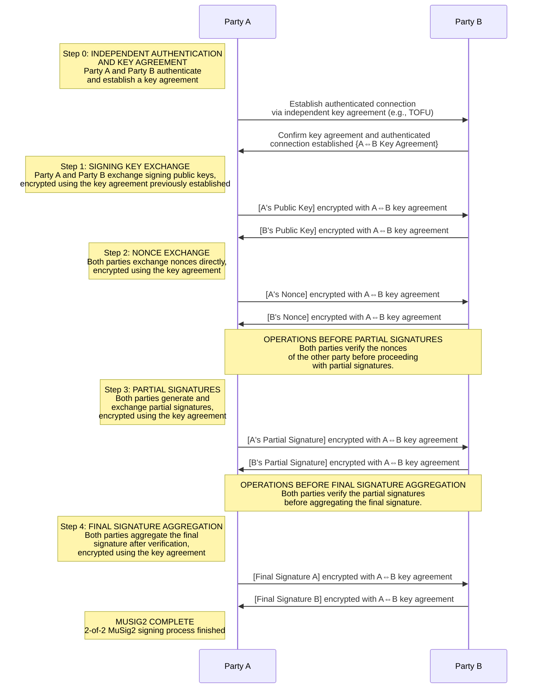

# MuSig2 Sequence Diagrams

* **ABSTRACT:** This document provides sequence diagrams for the MuSig2 multisignature protocol, covering 2-of-2 multisig with direct peer-to-peer interaction and 3-of-3 multisig with a Coordinator. It integrates GSTP and ESC to ensure secure, trustless communication, offering a practical guide for implementing efficient, private, and secure multisig solutions.

* **VERSION:** 0.1.1 (2024-05-05) - Initial Version Edited, Minor (for information on this versioning scheme, see [Status & Versioning](https://github.com/ChristopherA/Lists-of-High-Signal-Low-Noise-Links#status--versioning))

## Table of Contents

- [Introduction](#introduction)
  - [About MuSig2](#about-mysig2)
  - [Integration of GSTP and ESC](#integration-of-gstp-and-esc)
- [Overview of MuSig2 and Shared Assumptions](#overview-of-mysig2-and-shared-assumptions)
  - [Assumptions](#assumptions)
  - [Terms and Acronyms](#terms-and-acronyms)
- [MuSig2 2-of-2 Multisig with Peer-to-Peer Interaction](#musig2-2-of-2-multisig-with-peer-to-peer-interaction)
  - [Why a Coordinator is Not Required](#why-a-coordinator-is-not-required)
  - [Sequence Diagram](#sequence-diagram)
- [MuSig2 3-of-3 Multisig with Coordinator Facilitation](#musig2-3-of-3-multisig-with-coordinator-facilitation)
  - [Trustless Coordinator Assumptions](#trustless-coordinator-assumptions)
  - [Sequence Diagram](#sequence-diagram-1)
- [Conclusion](#conclusion)

---

## Introduction

This document provides visual sequence diagrams and explanations to help developers and cryptography enthusiasts understand the **MuSig2 multisignature protocol**. The guide focuses on two typical multisig setups: **2-of-2 multisig**, where two parties interact directly, and **3-of-3 multisig**, which requires trustless coordination through a **Coordinator**. Each section outlines the step-by-step process, from key exchange and nonce commitments to final signature aggregation, highlighting how parties communicate securely and verify each other's contributions.

To enhance security and trustlessness, the document integrates [**GSTP (Gordian Sealed Transport Protocol)**](https://developer.blockchaincommons.com/envelope/gstp/) and [**ESC (Encrypted State Encapsulation)**](https://developer.blockchaincommons.com/envelope/esc/). These technologies enable secure message routing and state management without compromising privacy, ensuring that even in complex multisig scenarios, sensitive information remains protected.

---

## About MuSig2

**MuSig2** is a multisignature (multisig) protocol designed to allow multiple parties to collaborate in generating a single valid digital signature, even though each party has its own private key. MuSig2 improves upon earlier multisig protocols, offering greater **efficiency**, **security**, and **privacy**, particularly in situations requiring multi-party approvals (e.g., securing cryptocurrency transactions or authorizing joint decisions).

Key advantages of MuSig2 include:
- **Scalability**: MuSig2 offers aggregated Schnorr signatures that are always the same size, whether they are a single signature or a multisignature.
- **Efficiency**: Compared to FROST and certain other multisig systems, MuSig2 minimizes the number of interactions between signers to just two rounds, making it practical for real-world applications. 
- **Security**: MuSig's nonce aggregation protects against the purposeful or accidental introduction of an insecure nonce from a single party.
- **Privacy**: Signature aggregation means that non-participants can't tell if a signature is a single-sig or multi-sig. When used in Taproot trees to enable threshold signing, MuSig's privacy advantages can increase because some leaves of allowable signatures are hidden.
- **Accountability**: Participants can choose to prove that they participated in a signature, something that is not trivially possible with FROST and certain other signature systems.

For more technical details, you can refer to:
- [BIP 327: MuSig2](https://github.com/bitcoin/bips/blob/master/bip-0327.mediawiki), the Bitcoin Improvement Proposal for the MuSig2 protocol.

This document demonstrates two distinct MuSig2 setups: **2-of-2 multisig**, where two parties communicate directly, and **3-of-3 multisig**, where a **Coordinator** facilitates communication between three parties.

---

## Integration of GSTP and ESC

The MuSig2 processes described here are designed to be implemented using the **GSTP (Gordian Sealed Transport Protocol)** and **ESC (Encrypted State Encapsulation)**. These technologies are critical for ensuring secure communication and trustless coordination among participants, especially in the **3-of-3 multisig** setup, where a Coordinator is involved.

- **GSTP (Gordian Sealed Transport Protocol)**: GSTP provides secure, private communication by wrapping messages in cryptographic envelopes, ensuring that only the intended recipients can decrypt and access the contents. This is crucial in the **3-of-3 multisig** setup, where the Coordinator routes messages between participants without being able to access the information themself.
  
- **ESC (Encrypted State Encapsulation)**: ESC ensures that the Coordinator remains trustless by managing the flow of the signing process without being able to decrypt or manipulate the internal state of the protocol. Each party encrypts its state and exchanges it with the Coordinator, who then returns the encrypted state at each step of the process.

To learn more about GSTP and ESC, refer to these resources:  
- [GSTP Overview](https://developer.blockchaincommons.com/envelope/gstp/)  
- [GSTP Technical Details](https://developer.blockchaincommons.com/envelope/gstp/tech/)  
- [ESC (Encrypted State Encapsulation)](https://developer.blockchaincommons.com/envelope/esc/)

---

## Overview of MuSig2 and Shared Assumptions

MuSig2 is a multisignature protocol that allows multiple parties to collaborate in creating a single valid signature. The protocol provides security and efficiency in settings where more than one party must authorize transactions or documents. Below are the shared assumptions that apply to both the **2-of-2 multisig** and **3-of-3 multisig** setups.

### Assumptions

- **Secure Key Agreements**: All parties must establish cryptographically secure key agreements, resistant to man-in-the-middle attacks, to ensure private and encrypted communication.
  
- **Nonce Security**: Nonces must be securely generated and exchanged in both setups to prevent malleability or signature forgery. Parties exchange nonce commitments before revealing their actual nonces to ensure fairness.

- **Authentication and Trust**: Parties must authenticate each other to establish trust, which can be achieved via **[TOFU](#terms-and-acronyms)**, pre-shared keys, or other agreed-upon methods.

- **Final Signature Aggregation**: The final aggregated signature is valid only if all required parties (either two in 2-of-2 or three in 3-of-3) contribute correct partial signatures.

### Terms and Acronyms

- **2-of-2 Multisig**: A type of multisig where both parties must participate to generate a valid signature.
- **3-of-3 Multisig**: A type of multisig where all three parties must participate to generate a valid signature.
- **ESC (Encrypted State Encapsulation)**: A mechanism used by the Coordinator in the **3-of-3 multisig** setup to encrypt and maintain the state of the process, ensuring that only the Coordinator can decrypt the state information.
- **MuSig2**: A Schnorr-based multi-signature protocol that allows multiple parties to jointly create a single valid signature.
- **Nonce Commitment**: A commitment to a nonce generated by a party, exchanged before the actual nonce to prevent manipulation of the signing process.
- **Partial Signature**: A partial signature generated by each party as part of the MuSig2 signing process, which is combined to create the final signature.
- **TOFU (Trust On First Use)**: A security model where trust is established on first interaction, often used to authenticate parties when establishing secure communication for the first time.

---

## MuSig2 2-of-2 Multisig with Peer-to-Peer Interaction

In this setup, two parties—**Party A** and **Party B**—interact directly without need for a **Coordinator**. They authenticate each other, establish a secure key agreement, and exchange messages securely to complete the multisignature process.

### Why a Coordinator is Not Required

In the **2-of-2 MuSig2 multisig process**, a **Coordinator is not required** because the process is entirely peer-to-peer. Party A and Party B manage all aspects of communication and verification directly:

1. **Direct Communication**: Party A and Party B handle all message exchanges (public keys, nonce commitments, nonces, and partial signatures) independently.
2. **Peer Authentication**: Before proceeding, Party A and Party B authenticate each other using an independent key agreement, such as **[TOFU](#terms-and-acronyms)** or pre-shared keys.
3. **Simplified Process**: Each party is responsible for managing its own state, so no external party is needed to track the signing process.
4. **Efficient and Secure**: End-to-end encryption secures all communication between the two parties, with no third-party involvement.

### Sequence Diagram for 2-of-2 MuSig2 Setup

The following diagram illustrates the 2-of-2 MuSig2 signing process, showing how Party A and Party B establish a secure connection, exchange their public keys and nonces, and complete the multisig process by combining their partial signatures.

---

  ## MuSig2 3-of-3 Multisig with Coordinator Facilitation

  In this setup, three parties—**Party A**, **Party B**, and **Party C**—require the assistance of a **Coordinator** to facilitate the secure exchange of public keys, nonce commitments, and signatures. The Coordinator ensures that all parties' inputs are routed securely and maintains the process state through **Encrypted State Encapsulation (ESC)**. The goal is to make the Coordinator's role as **trustless as possible**.

  ### Trustless Coordinator Assumptions

  - **Coordinator Does Not Access Sensitive Data**: The Coordinator facilitates the exchange of data between parties but does not have access to the sensitive information being exchanged. Public keys, nonce commitments, nonces, and signatures are all **encrypted** using the independent key agreements established between the Coordinator and each party. The Coordinator cannot decrypt any of these values and simply acts as a messenger.

  - **Independent Key Agreements**: Each party (A, B, and C) must establish its own secure key agreement with the Coordinator. These agreements are independent and cryptographically secure, ensuring that the Coordinator cannot act as a point of compromise between parties.

  - **State Management Through ESC**: The Coordinator manages the signing process by maintaining its state using **Encrypted State Encapsulation (ESC)**. This ensures that only the Coordinator can access the state information, while all communication related to state transitions is encrypted and returned to the Coordinator by the parties involved.

  - **Single-Use Tokens for Authentication**: To establish trust during the initial key agreements, the Coordinator distributes **single-use tokens**. Party A requests the multisig process and receives tokens for Party B and Party C, which they use to authenticate themselves to the Coordinator and establish their own key agreements.

  - **Routing Only**: The Coordinator's primary role is to route messages between parties. It passes encrypted data between the participants, ensuring that no party can tamper with or alter the information exchanged during the multisig process. However, it cannot read or modify the contents of the messages it routes.

  In summary, while the Coordinator is crucial for facilitating communication in the **3-of-3 MuSig2** multisig process, it remains **trustless** by not accessing sensitive data and focusing solely on routing messages and securely managing state transitions via **ESC**.

To align the sequence diagram with MuSig2’s original design, where there should be only one round for nonce exchange (no separate nonce commitment round), I’ll remove the redundant nonce commitment step and consolidate the process as requested. Here’s the corrected sequence diagram:

### Sequence Diagram for 3-of-3 MuSig2 Setup with Trustless Coordinator Facilitation

```mermaid
sequenceDiagram
    participant Coordinator
    participant Party A
    participant Party B
    participant Party C
    Note left of Coordinator: Step 0: INDEPENDENT AUTHENTICATION<br/>AND KEY AGREEMENT <br/>Parties authenticate and establish <br/>key agreement to request <br/>MuSig2 facilitation.

    Note over Party A, Coordinator: Step 0.1: Party A initiates a <br/>request for key agreement <br/>with the Coordinator.

    Party A->>Coordinator: Request TOFU key agreement <br/>with Coordinator

    Coordinator->>Party A: TOFU key agreement established <br/>Coordinator⇔A
 
    Note right of Party A: Party A verifies the Coordinator’s <br/>authenticity via TOFU

    Note over Party A, Coordinator: Step 0.2: Party A requests a <br/>3-party MuSig2 session

    Party A->>Coordinator: Party A sends Coordinator 3:3 MuSig2 <br/>facilitation request and A's key agreement <br/>keys to be used to introduce parties, <br/>(this request is encrypted with <br/>Coordinator⇔A key agreement)

    Note right of Coordinator: Step 0.3: Coordinator creates and sends <br/>single-use tokens for B and C, <br/>that introduce B & C to the coordinator, <br/>containing key agreement keys for each party, <br/>(this response is encrypted with <br/>Coordinator⇔A key agreement)

    Coordinator->>Party A: Sends Party A tokens for <br/>Parties B and C 
    
    Note over Party A, Party C: Step 0.4: Party A distributes single-use tokens <br/>to Parties B and C

    Party A->>Party B: Send single-use token for <br/>Party B out-of band (signal, nostr, etc.)

    Party A->>Party C: Send single-use token for <br/>Party C out-of band (signal, nostr, etc.)

    Note over Party B, Party C: Step 0.5: Actions for Parties B <br/>and C to authenticate with <br/>the Coordinator

    Note over Party B, Coordinator: Step 0.6: Party B uses token to <br/>authenticate and establish <br/>key agreement

    Party B->>Coordinator: Establish key agreement <br/>using token 

    Coordinator->>Party B: TOFU Key agreement established <br/>Coordinator⇔B

    Note over Party C, Coordinator: Step 0.6: Party C uses token to <br/>authenticate and establish <br/>key agreement

    Party C->>Coordinator: Establish key agreement <br/>using token 

    Coordinator->>Party C: TOFU key agreement established <br/>Coordinator⇔C

    Note right of Coordinator: Step 0.7: Coordinator verifies single-use tokens, <br/>confirms key agreements exist for all parties, <br/>and MuSig2 process setup is ready to proceed.

    Note left of Coordinator: Step 1: SIGNING KEY EXCHANGE <br/>parties exchange public keys, <br/>encrypted using key agreement

    Note right of Coordinator: Step 1.1: Coordinator passes <br/>encrypted public keys <br/>between parties <br/>(all P2P encrypted with Coordinator<⇔Party key <br/>agreements--however Coordinator can't decrypt any of <br/>the Parties's shared public keys).

    Party A->>Coordinator: A’s Public Key encrypted <br/>with A⇔B key agreement 
    
    Party A->>Coordinator: A’s Public Key encrypted <br/>with A⇔C key agreement 

    Party B->>Coordinator: B’s Public Key encrypted <br/>with B⇔A key agreement 
    
    Party B->>Coordinator: B’s Public Key encrypted <br/>with B⇔C key agreement 

    Party C->>Coordinator: C’s Public Key encrypted <br/>with C⇔A key agreement 

    Party C->>Coordinator: C’s Public Key encrypted <br/>with C⇔B key agreement 

    Note over Party A, Party C: Step 1.2: Each party verifies <br/>others’ public keys before proceeding.

    Note left of Coordinator: Step 2: NONCE COMMITMENT <br/>Parties exchange nonce commitments,<br/>encrypted using the key agreement
  
    Note right of Coordinator: Step 2.1: Coordinator passes <br/>encrypted nonces between <br/>parties

    Party A->>Coordinator: A’s Nonce encrypted <br/>with A⇔B 

    Party A->>Coordinator: A’s Nonce encrypted <br/>with A⇔C 

    Party B->>Coordinator: B’s Nonce encrypted <br/>with B⇔A 

    Party B->>Coordinator: B’s Nonce encrypted <br/>with B⇔C 

    Party C->>Coordinator: C’s Nonce encrypted <br/>with C⇔A 

    Party C->>Coordinator: C’s Nonce encrypted <br/>with C⇔B 

    Note over Party A, Party C: Step 2.2: All parties verify <br/>each other’s nonces before signing.

    Note left of Coordinator: Step 3: PARTIAL SIGNATURE EXCHANGE <br/>After verifying nonce commitments, <br/>the parties exchange partial signatures, <br/>(encrypted using their peer key agreements)

    Note right of Coordinator: Step 3.1: Coordinator passes <br/>P2P encrypted partial signatures. <br/>(The Coordinator can't decrypt any of <br/>the parties's shared partial signatures.)

    Party A->>Coordinator: A’s Partial Signature <br/>encrypted with A⇔B 
    
    Coordinator->>Party B: A’s Partial Signature 

    Party A->>Coordinator: A’s Partial Signature <br/>encrypted with A⇔C 
    
    Coordinator->>Party C: A’s Partial Signature 

    Party B->>Coordinator: B’s Partial Signature <br/>encrypted with B⇔A
    
    Coordinator->>Party A: B’s Partial Signature 

    Party B->>Coordinator: B’s Partial Signature <br/>encrypted with B⇔C 

    Coordinator->>Party C: B’s Partial Signature

    Party C->>Coordinator: C’s Partial Signature <br/>encrypted with C⇔A 

    Coordinator->>Party A: C’s Partial Signature

    Party C->>Coordinator: C’s Partial Signature <br/>encrypted with C⇔B

    Coordinator->>Party B: C’s Partial Signature 

    Note over Party A, Party C: Step 3.2: Parties verify all <br/>partial signatures before aggregation.

    Note left of Coordinator: Step 4: SIGNATURE AGGREGATION <br/>After verifying partial signatures, <br/>the parties aggregate signatures, <br/>(encrypted using their peer key agreements)

    Note right of Coordinator: Step 4.1: The coordinator passes P2P encrypted <br/>final signatures for aggregation. <br/>(The Coordinator can't decrypt any of <br/>the parties's shared partial signatures.)
    
    Party A->>Coordinator: A’s Final aggregated signature <br/>(encrypted with A⇔B)
    
    Coordinator->>Party B: A’s Final aggregated signature <br/>Returned

    Party A->>Coordinator: A’s Final aggregated signature <br/>(encrypted with A⇔C )
    
    Coordinator->>Party C: A’s Final aggregated signature <br/>Returned

    Party B->>Coordinator: B’s Final aggregated signature <br/>(encrypted with B⇔A)
    
    Coordinator->>Party A: B’s Final aggregated signature <br/>Returned

    Party B->>Coordinator: B’s Final aggregated signature <br/> (encrypted with B⇔C)

    Coordinator->>Party C: B’s Final aggregated signature <br/>Returned

    Party C->>Coordinator: C’s Final aggregated signature <br/>(encrypted with C⇔A)

    Coordinator->>Party A: C’s Final aggregated signature <br/>Returned

    Party C->>Coordinator: C’s Final aggregated signature <br/>(encrypted with C⇔B)

    Coordinator->>Party B: C’s Final aggregated <br/>signature Returned

    Note over Party A, Party C: Step 4.2: The parties verify that <br/>the final aggregated signatures <br/>from all other parties match

    Note left of Coordinator: MUSIG2 FACILITATION COMPLETE
```

---

## Conclusion

This document demonstrates how the **MuSig2 multisignature protocol** can be implemented in both peer-to-peer and **Coordinator**-facilitated setups. By integrating **GSTP** and **ESC**, participants can ensure that communication remains secure, private, and trustless—especially in scenarios requiring more complex coordination between multiple parties. The sequence diagrams and assumptions provided here offer a practical framework for developers to implement secure multisig solutions using MuSig2.
