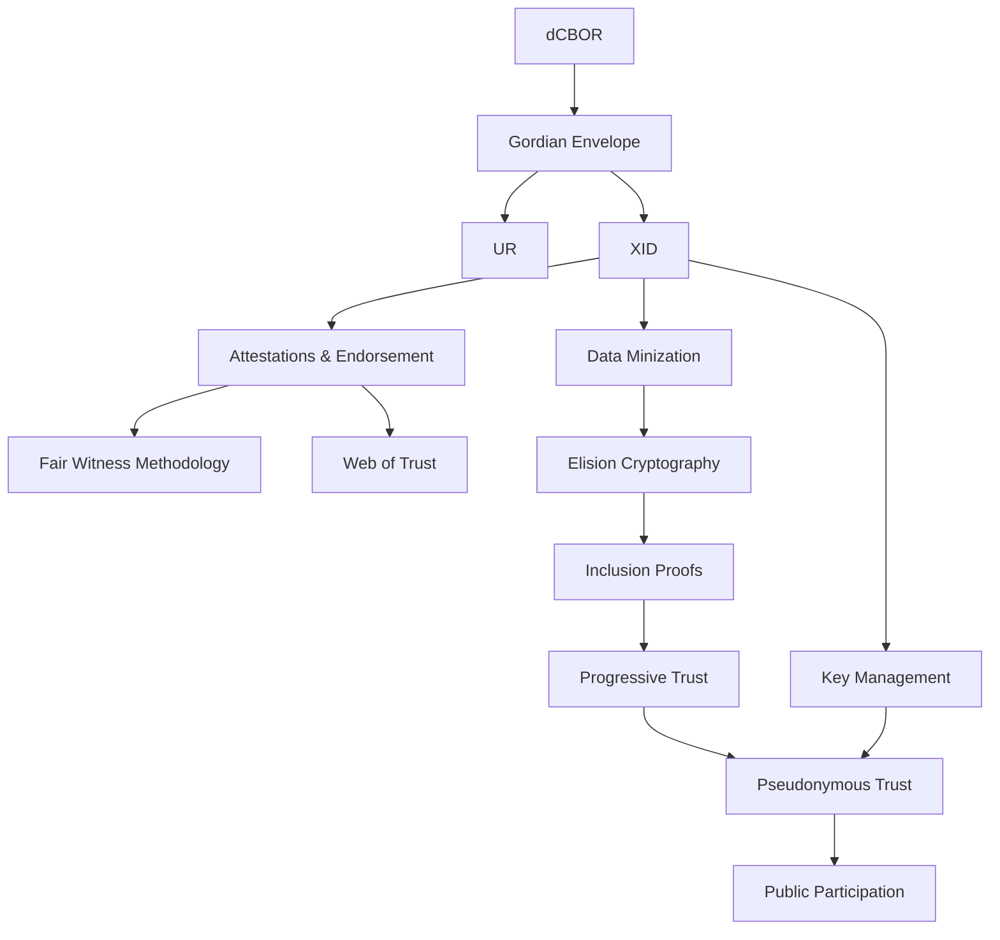

**Target Technology:** Self-Sovereign Identity (XID) 
**Target Audience:** SSI Developers

_These touchpoints reveal the components of Blockchain Commons'
self-sovereign identity pilot, the XID, and also detail the various
functionalities and philosophies that we believe make it true to the
original concepts of self-sovereignty. If you're a developer
interesting in adopting the methodologies and design principles built
into XIDs (or even XIDs themselves), this is the touchpoint tree for
you._

# I: The Road to XIDs

_XIDs are a capstone built on a number of other Blockchain Commons
technologies. The following describes the major technologies that they
incorporate._

##  dCBOR: The Canonical Encoding

**Technology.** Blockchain Commons' technologies are built on dCBOR, a
deterministic version of the
[CBOR](https://datatracker.ietf.org/doc/html/rfc894) binary data
format. It's a structured and self-describing data format that is
fully extensible. We've taken advantage of that to create the dCBOR
application profile, which ensures that CBOR is always encoded in the
same way, no matter what system you're on.

This is what permits the hashed elision of Gordian Envelope to work:
data will always be encoded in the exact same format, no matter what
system you're on, which means that the hash for the same data will
always be the same, allowing for the creation of commitments (and
their later use in inclusion proofs, to prove the prior existence of
elided data).

As a SSI developer, you don't need to worry much about dCBOR, other
than knowing it's how envelopes (and therefore XIDs) are encoded.

* For more, see [**dCBOR**](/dcbor/).
* For more, see [**CBOR**](/cbor/).

##  UR: Plain-Text CBOR

**Technology.** dCBOR is a binary format, which means that it's not
human readable, but moreso it's somewhat difficult to pass
around. Blockchain Commons resolves that issue with URs, or Uniform
Resources, which are a way to encode structured CBOR binary data in
plain text strings that are also URIs.

URs are built with another Blockchain Commons' specification called
[ByteWords](/bytewords/). Each byte of data is translated into a
four-letter word, which can also be stored as just its first and last
letter. All of the bytes that make up the binary CBOR are laid out in
this way, then they're checksummed, then they're prefixed with a `ur`
and a type, e.g., `ur:envelope/`. They can also be broken up into a
multi-part UR (MUR).

URs were built to be very efficient for encoding as QRs, while MURs
were built to allow the creation of [animated QRs](/animated-qrs/),
which make it possible to store larger amounts of data in a QR than
you could with a static QR code.

Again, the details aren't that important to understand XIDs: you
should just know that a UR of an envelope (or a XID) is a text-based
encoding of the underlying CBOR and that it can easily and efficiently
be turned into QRs.

* For more, see [**URs**](/ur/).
* For more, see [**MURs**](/ur/mur/).
* For more, see [**ByteWords**](/bytewords/).
* For more, see [**Animated QRs**](/animated-qrs/).

##  Gordian Envelope: The Structural Framework

**Technology.** Gordian Envelope is the "smart document" system that
is the heart of XIDs. It stores data as semantic triples, with a
subject, a predicate, and an object. The predicate and object form an
"assertion" about the subject.

Its additional capabilities are what make it "smart": data within the
document can be digitally signed, allowing for cryptographic
verification; and any element of data can be removed without affecting
the signatures, allowing for data minimization. These elements are
what make the core design of XIDs possible.

Envelopes are encoded in dCBOR and they're often output as
`ur:envelope/` (possibly within a QR code) when they need to be
stored, printed, or transmitted.

* For more, see [**Envelope**](/envelope/).

##  XID: Extensible Identifiers

**Technology Pilot.** XIDs are a self-sovereign identity system that
offer our view of what DIDs should be (and what we hope to see in some
future version of the DID standard). They're intended to be truly
self-sovereign in a way that modern DIDs are not, by which we mean
controlled by the user in every aspect. They also have a number of
other features that we consider crucial, all of which are outlined in
the next section.

Technically, a XID (eXtensible IDentifier, pronounced "zid") is a
unique 32-byte identifier derived from a cryptographic key. It
provides a stable digital identity that remains consistent even as the
keys associated with it evolve over time. It can be associated with
nicknames and a variety of rotatable keys and can be filled with
attestations of all types that help define the identity.

* For more, see [**XID**](/xid/), and also the following.

# II: The Power of XIDs

_XIDs were built with a few specific purposes: to enable true
self-sovereign identity, controlled by the user; and to support the
[Amira use
case](https://www.blockchaincommons.com/articles/amira-update/). The
following describes the more precise requirements & technologies built
into them._

##  Attestation & Endorsement Model: A Framework for Claims

**Methodology.** Though a bare identifier is enough to say who someone
is, more data needs to accrue around it for that identifier to form
the nucleus of a true identity. These come primarily through
attestations and endorsements.

Attestations are statements about something. They can be statements
that an identity makes about something it knows or has observed (an
attestation), that an identity makes about itself (a
self-attestation), or that one identity makes about another identity
(an endorsement).

For attestations to have force, they must come from an attestor
identity that is trusted. For attestations to be verified, they must
be signed with a key associated with an identity.

* For more, see [**Attestations**](/identity/attestations/).

##  Web of Trust: Assessing Endorsor Trust

**Methodology.** Just because someone endorsed someone else doesn't
mean that the endorsement carries any weight of trust. You need
additional context to be able to validate an endorsement.

One way to do so is through a Web of Trust. You can assess the level
of trust for someone's endorsement by seeing who their relations are
and whether they're people that you trust. This "trust search" can can
recurse through several levels, creating a "web" of trust.

The design of a a web of trust is easy: identities need to be able to
link to each other in provable (signed) ways. The assessment of that
web and what it means requires either human validation or
sophisticated (but transparent) ways to calculate trust
algorithmically

* For more, see [**Web of Trust**](/identity/weboftrust/).

##  Fair Witness: Making Trustworthy Claims

**Methodology.** Another way to assess the trustworthiness of
attestations of any sort is by examining how they're made. The fair
wintess methodology requires you to include bias, relationship, and
other data in your attestations to provide them with context.

A fair witness methodology still doesn't tell you if an attestation is
accurate, because an attestor could offer dishonest context. But it
might increase your faith, especially if non-flattering context is
revealed, and it might provide more details that you check to try and
improve validation.

* For more, see [**Fair Witness Methodology**](/identity/fair-witness/).

##  Data Minimization: Controlling Identity Disclosure

**Design Principle.** Having attestations doesn't meant that you want
to reveal attestations. Some may be private, some may be intended only
for limited distribution, and some may be laid in now so that they
have more weight in the future.

But the philosophy of data minimization goes even further than that:
it says that you should never reveal more information that is needed
for a specific task. If someone needs to affirm that you're in a
specific age range, all you should have to do is prove your presence
in that range, not reveal your age, let alone other information such
as your name address. This is an improvement on current, non-digital
means, where an age requirement often means you have to hand over your
driver's license, revealing those details to a random validator.

Data Minimization is a subset of the Least & Necessary principles and
it's usually accomplished through Selective Disclosure: being able to
report out only part of a data set.

* For more, see [**Data Minimization Principle**](/architecture/data-minimization/).
* For more, see [**Least & Necessary Principles**](/architecture/least-necessary/).

##  Elision Cryptography: The Cryptography of Data Minimization

**Technology.** How do you remove something to achieve data
minimization? One answer is through elision cryptography (or hashed
elision). Envelope supports this by hashing each leaf of its
data. When things are removed from an envelope for data minimization,
the data is removed, but the hash remains. This allows signatures to
remain in place and valid, because they're made across the hashes
rather than the complete content.

One of the other advantages of envelope's system of hashed elision is
that it's entirely controlled by the holder of an envelope. Many other
data solutions require Issuers to decide what can be elided. Envelope
practices self-sovereignty by putting it all in the hands of the user.

* For more, see [**Hashed Elision**](/hashed-elision/).

##  Inclusion Proofs: The
Cryptography of Data Revelation

**Technology.** An inclusion proof is the flipside to hashed
elision. After you've elided to minimize your data, you might reveal
it either to certain planned people or to someone as part of the
process of progressive trust. That's what an inclusion proof does.

The hash that you left in your envelope (or possibly a hash
representing an entirely elided envelope) becomes a commitment: it's
proof that you said something at the time you released your envelope.

An inclusion proof then reveals the data that correctly hashes to the
previously published hash. Some of it might still be elided!

* For more, see [**Hashed Elision**](/envelope/inclusion-proof/).

## Progressive Trust

**Design Principle.** Progressive trust is a simple methodology for
how you release data over time. It says that you can increase the
amount of data released to a specific person over time as your trust
of them increases.

This is offered instead of an all-or-nothing reveal, where everything
is revealed to someone at once. It's also the way that trust works in
the real world.

* For more, see [**Progressive Trust**](/architecture/progressive-trust/).

##  Key Management Essentials

**Methodology.** Self-sovereign identity depends on holding your own
keys and keeping them well protected. It's not technical, but it's
nonetheless one of the most challenging parts of maintaining a
self-sovereign identity, because if you lose a key, you lose your identity.

Key management is a methodology that marks the importance of keys,
because they act as Single Points of Failure and Single Points of
Compromise and suggests best practices for how to keep them
safe. (Those best practices are also enabled in XIDs.)

* For more, see [**Key Management**](/keys/)

##  Pseudonymous Trust Building

**Design Principle.** Pseudonymous trust is a design principle that
says that digital identities do not have to be linked to real-world
identities. Though they are stable, that stability is centered on a
digital-only identifier.

For a pseudonymous identity to be meaningful, it must have ways that
trust can be built around an identity over time. Our architectural
discussion of pseudonymous identities suggests some ways to do so, but
the fundamental design of XIDs is also centered on these requirements.

* For more, see [**Pseudonymous Trust Building**](/architecture/pseudonym/).

##  Public Participation Profiles

**Technology.** A public participation profile is a specific type of
identity built on the philosophy of Pseudonymous Trust Building. It
requires a stable pseudonymous identifier, the ability to self-attest,
the ability to endorse, and the ability to commit to attestations
without revealing them.

That's a XID: it's what we've been working toward with the various
design principles, methodologies, and technologies described in this
series of touchpoints.

It's our vision of self-sovereign identity.

* For more, see [**Public Participation Profiles**](/identity/ppp).
